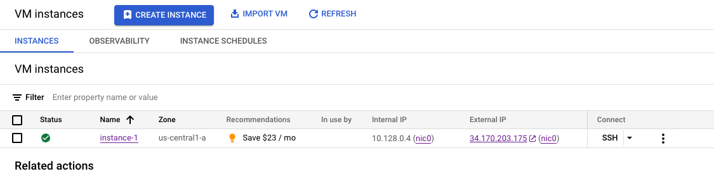
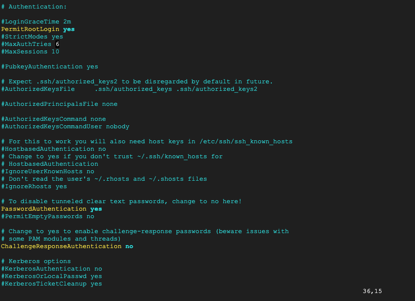
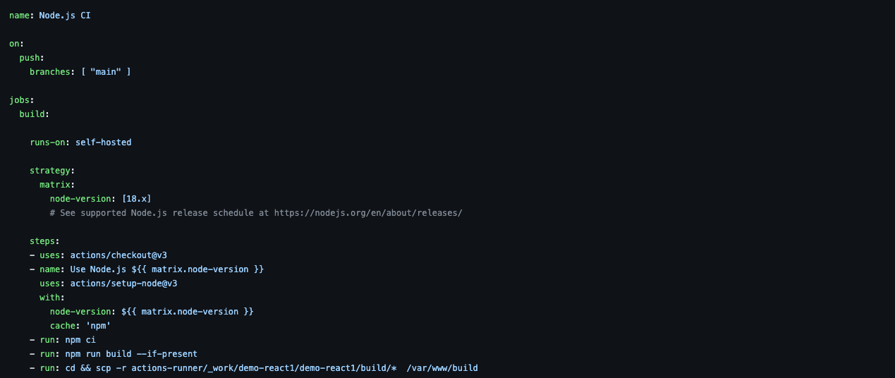
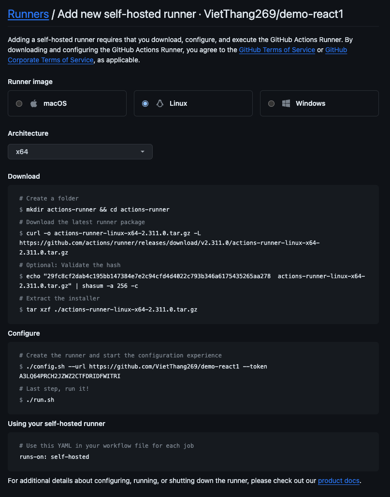
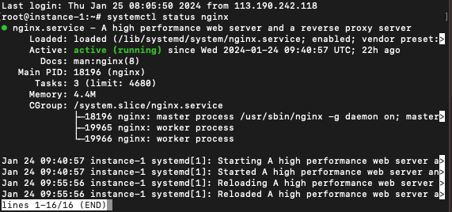
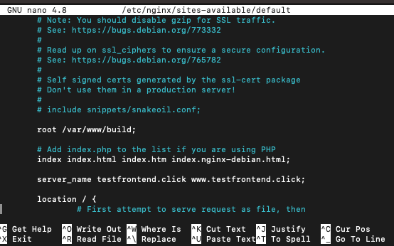
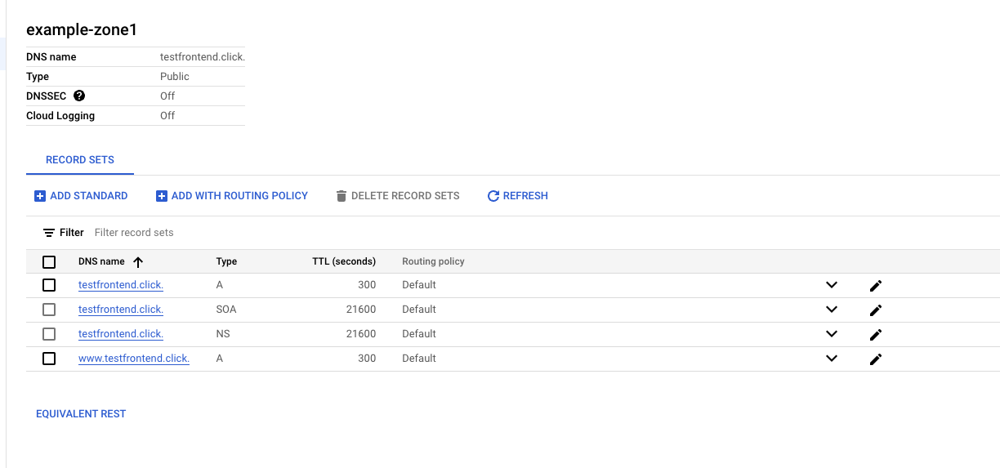
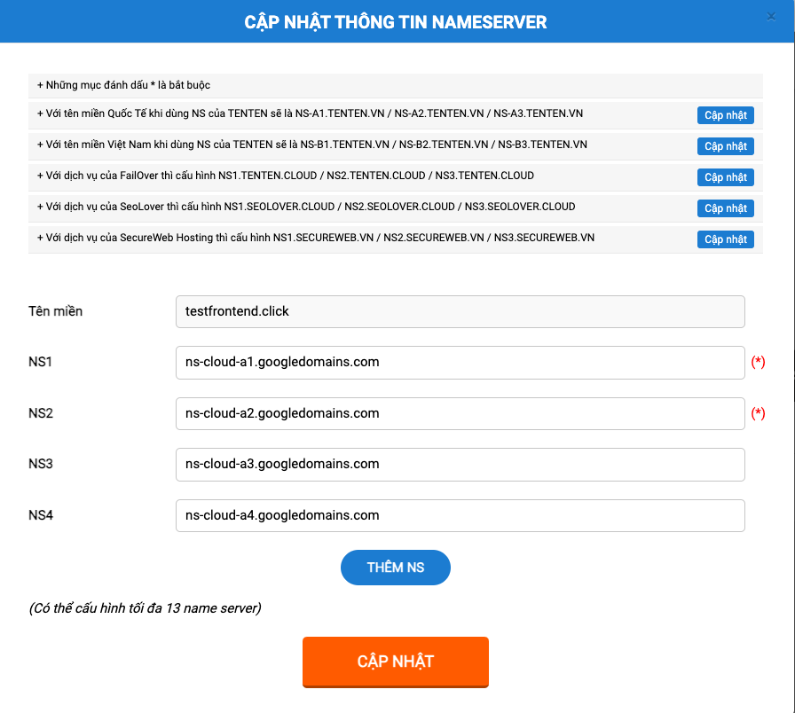

# Setup VM Ubuntu 20.4 LTS in GG Cloud with Compute Engine



# Config SSH by password

## Create new password

```bash
sudo passwd
```

## Update SSHD Config (need root user)

```bash
vi /etc/ssh/sshd_config
```

Change

* PermitLogin: yes
* PasswordAuthentication: yes



## Restart SSHD

```bash
service restart sshd.service
```

# Setup CI/CD Github Actions

## Create github flow


## Configure in VM


# Config Nginx, Setup DNS and SSL Certificate by Certbot

## Congig Nginx

```bash
sudo apt install nginx
```



Change config file nginx

* root /var/www/build (need create folder first)

* update server_name by domain



## Setup DNS in Network Service GG and Tenten for domain





## Setup SSL by Certbot

```bash
sudo certbot --nginx -d testfrontend.click -d www.testfrontend.click
```

Link: https://www.testfrontend.click/
